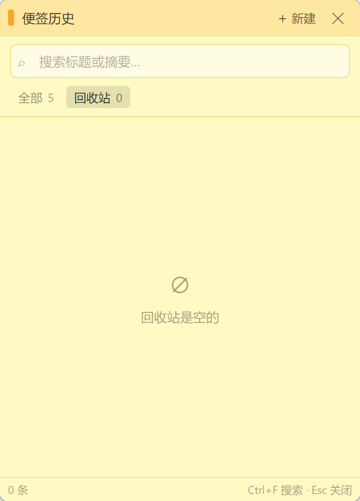

# MarkdownNote · 便签

Windows 桌面 Markdown 便签。轻量、可置顶，预览为主，支持图片粘贴、任务列表勾选与历史管理。

[](https://github.com/ZyPLJ/MarkdownNote/releases/latest)
[](https://github.com/ZyPLJ/MarkdownNote/actions)

## 截图

| 便签预览 | 历史面板 |
|:---:|:---:|
|  |  |

## 下载

到 [Releases](https://github.com/ZyPLJ/MarkdownNote/releases/latest) 下载 Windows 安装包：

| 文件 | 说明 |
|------|------|
| `MarkdownNote-Setup-x.y.z.exe` | NSIS 安装程序（可改安装目录） |

安装后开始菜单 / 桌面会出现「便签」快捷方式。

## 功能

- **多便签窗口**：无边框拖拽缩放，颜色 / 置顶 / 透明度
- **Markdown**：预览为主，双击进入编辑，`Esc` 回预览，`Ctrl+E` 切换
- **任务列表**：GFM `- [ ]` / `- [x]`，预览中可直接勾选，支持多层级缩进
- **图片**：预览/编辑均可 `Ctrl+V` 或拖入；多图；大图自动压缩；`attach://` 本地协议
- **便签历史**：暖色色卡列表、搜索、全部/回收站、恢复与永久清除、实时刷新
- **系统托盘**：新建、历史、显示/隐藏全部、退出
- **关闭 = 隐藏**（数据保留）；删除为软删除，可在回收站恢复
- **本地存储**：JSON 自动保存（防抖 500ms + 原子写）

## 开发

```bash
npm install
npm run dev
```

## 打包

```bash
npm run dist
```

安装包输出到 `release/`（默认文件名 `MarkdownNote-Setup-<version>.exe`）。

> 国内离线环境可把 `nsis-*.7z` 与 `rcedit-x64.exe` 放到 `tools/`，脚本会优先走本地缓存。

## 发布（GitHub Actions）

推送版本标签后自动构建 Windows 安装包并创建 Release：

```bash
# 先改 package.json 的 version，再打标签
git tag v1.0.0
git push origin v1.0.0
```

也可在 Actions 页手动运行 **Release** 工作流。

## 数据位置

| 内容 | 路径 |
|------|------|
| 便签数据 | `%APPDATA%/bianqian/notes.json` |
| 图片附件 | `%APPDATA%/bianqian/_attachments/` |

（即 Electron `app.getPath('userData')`）

## 快捷键

| 快捷键 | 作用 |
|--------|------|
| `Ctrl+Alt+N` | 新建便签（全局） |
| `Ctrl+N` | 当前窗/历史窗内新建 |
| `Ctrl+E` | 编辑 / 预览切换 |
| `Esc` | 编辑→预览；历史窗清空搜索或关闭 |
| 双击内容区 | 进入编辑 |
| 预览中点击任务勾选框 | 勾选 / 取消任务 |
| `Ctrl+V` / 拖入 | 插入图片（预览、编辑均可） |
| `Ctrl+F` | 历史窗内聚焦搜索 |

## 历史面板

- 标题栏与便签同款：左侧色条 + 暖黄底
- 每条记录为对应颜色的迷你色卡（标题、摘要、相对时间、显示中/已隐藏）
- **全部** / **回收站**；回收站支持恢复、单条清除、清空
- 变更后通过 `notes:changed` 自动刷新

## 项目结构（摘要）

```
electron/main/     主进程：IPC、存储、窗口、托盘、图片、协议
electron/preload/  contextBridge API
electron/shared/   共享类型与 deriveTitle / deriveSnippet
src/               Vue 渲染：便签窗 + 历史窗
scripts/           Windows 打包与图标脚本
.github/workflows/ Release 自动构建
```

更完整的产品与技术说明见 [Markdown桌面便签-设计方案.md](./Markdown桌面便签-设计方案.md)。

## License

MIT
